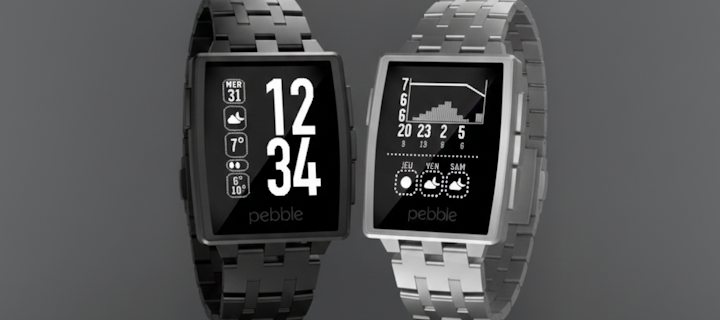

# Din Clean - Weather Watchface for Pebble

**Din Clean** is a modern and refined watchface for Pebble smartwatches, combining exceptional readability with comprehensive and detailed weather information.

---

## Screenshots

*Monday 5th, extremely strong wind with sunny weather. Current temperature: 28°C. Comfortable humidity shown by the leaf icon. Min/Max: 10°/20°C.*

*Sample forecast data showing rain expected on Wednesday and snow on Thursday. A cold front is expected around 5pm, dropping the temperature by 10 degrees with heavy rain.*

---

## Key Features

### Time Display
- Large digits for instant reading
- Custom Clearview font for optimal legibility
- Automatic 12h/24h format based on system settings
- Design inspired by the classic **Din Time** watchface

### Real-time Weather
- Current temperature with weather icon
- Daily Min/Max temperatures
- Visual humidity indicators (water drops)
- Visual dryness indicators (cactus icons)
- Wind speed with corner-based visual indicators
- Data via **MET Norway API** (accurate and free — **no API key required!**)

### Secondary Panels (Shake to Access)
Din Clean offers **two secondary panels** accessible by shaking your wrist:

#### 1. Weather Forecast Graph
- Temperature curve over 12 hours
- Hourly precipitation bars
- Reference lines at 25%, 50%, and 75% (dotted) for easier reading
- Wind speed per time slot
- 3-day forecast with weather icons and weekday labels

#### 2. Quick Read News Panel (RSVP/Spritz)
- **Speed-reading technology** based on the Spritz/RSVP method
- Displays RSS news headlines **word by word** at optimized speed (~350-500 WPM)
- **Pivot letter highlighting** for instant word recognition
- **Smart pause system**: longer pauses after punctuation (periods, commas)
- Customizable RSS feed (Breaking News, Gaming, Finance presets available)
- Shows journal/channel name on splash screen
- Auto-advances through 5 headlines per session

### Smart Indicators
- Bluetooth connection status
- Quiet time mode indicator
- Localized day and date (EN, FR, DE, ES)

### IOPool Integration (optional)
- Visual alerts when pool water parameters are out of range
- Triggered automatically when ORP < 650 or pH < 7.10
- Requires IOPool API token in settings

---

## Design Philosophy: Maximum Readability

Din Clean was designed with **readability as the top priority**. This is why a strict **black and white** color scheme was chosen — no distracting colors, just pure contrast for instant information at a glance. The clean monochrome design ensures your watch remains legible in any lighting condition, from bright sunlight to dim environments.

The main time display is inspired by **Din Time**, a beloved watchface that is no longer maintained. Din Clean pays homage to its elegant typography while adding comprehensive weather features and modern API support.

---

## User Guide: Secondary Panels

### Accessing the Panels

To display secondary panels, **shake your wrist**:
- If "Require double tap" is enabled (default): shake **twice** with a **2-second interval** between shakes
- If disabled: a single shake activates the panel

The double-tap option prevents accidental activations during normal movement.

**Panel Navigation:**
1. **First shake** → Weather Graph
2. **Second shake** → News Feed (if enabled)
3. **Third shake** → Return to main watch face

Each panel auto-dismisses after 8 seconds of inactivity (weather graph) or after displaying all headlines (news feed).

---

## User Guide: Understanding the Visual Indicators

### Humidity & Dryness Icons

The main screen displays up to 3 small icons indicating the current humidity level. Here's how to interpret them:

| Icons Displayed | Humidity Level | Meaning |
|-----------------|----------------|---------|
|  Leaf (1 icon) | 40% – 60% | **Comfort zone** – Ideal humidity level |
|  1 drop | 60% – 69% | Slightly humid |
|  2 drops | 70% – 79% | Humid |
|  3 drops | 80%+ | Very humid / Rainy conditions |
|  1 cactus | 31% – 40% | Slightly dry |
|  2 cacti | 21% – 30% | Dry – Consider hydrating! |
|  3 cacti | ≤20% | Very dry – Extremely low humidity |

---

### Weather Graph: Precipitation Bars

When you tap on the watch to display the forecast graph, you'll see precipitation bars alongside the temperature curve.

**Rain Scale:**
- **A full bar represents 40mm of rain** for that hour
- Each bar shows the expected precipitation amount proportionally
- This helps you quickly assess rainfall intensity:
  - Small bar (~5mm): Light rain
  - Medium bar (~15-20mm): Moderate rain
  - Full bar (40mm): Heavy rain / storms

**Reference Lines:**
The graph now includes three horizontal dotted reference lines:
- **25% line** (top quarter)
- **50% line** (middle)
- **75% line** (bottom quarter)

These lines help you quickly gauge where the temperature curve sits within the forecast range.

---

### Wind Speed: Corner Indicators

The main weather icon is surrounded by a decorative border. As wind speed increases, **corners of this border light up** to provide a quick visual indicator of wind intensity:

| Wind Level | Icon | Metric | Imperial |
|------------|------|--------|----------|
| No wind |  | ≤5 km/h | ≤11 mph |
| Light breeze |  | >5 km/h | >11 mph |
| Moderate wind |  | >10 km/h | >22 mph |
| Fresh wind |  | >15 km/h | >33 mph |
| Strong wind |  | >20 km/h | >44 mph |

This allows you to quickly assess wind conditions at a glance without reading numerical values.

---

### Quick Read News Panel (RSVP)

The news panel uses **Rapid Serial Visual Presentation (RSVP)**, a speed-reading technique popularized by Spritz. Here's how it works:

**How It Works:**
1. Headlines are displayed **one word at a time** in the center of the screen
2. Each word has a **pivot letter** (shown in bold) — the optimal recognition point
3. Guide lines help your eyes stay focused on the reading position
4. The display automatically pauses longer after punctuation for natural reading rhythm

**Reading Speed:**
- Base speed: ~160ms per word (~375 words per minute)
- Extended pause after sentence endings (. ! ?)
- Medium pause after commas and semicolons
- Extra time for long words (>8 characters)

**Customization:**
You can customize the RSS feed URL in the settings to follow your favorite news sources. Three presets are provided:
- **Breaking News** (general headlines)
- **Gaming** (video game news)
- **Finance** (market and business news)

---

### IOPool Visual Alerts

For pool owners with IOPool smart probes, Din Clean provides **automatic visual alerts** when water parameters fall outside safe ranges:

**Alert triggers:**
- ORP < 650 (disinfection effectiveness issue)
- pH < 7.10 (water too acidic)

When these conditions are detected, a visual indicator appears on the watchface to notify you that pool maintenance may be required.

*Note: This feature requires an IOPool API token configured in the watchface settings.*

---

## No API Key Required!

Unlike many weather watchfaces, **Din Clean uses the MET Norway API**, which is:
- **Completely free** — No subscription needed
- **No API key required** — Works out of the box
- **Highly accurate** — Powered by the Norwegian Meteorological Institute
- **Worldwide coverage** — Works anywhere in the world

Just install, allow location access, and enjoy!

---

## Configuration Options

Access the settings page through the Pebble app to customize:

| Option | Description |
|--------|-------------|
| **Units** | Switch between Metric (°C, km/h) and Imperial (°F, mph) |
| **Bluetooth vibration** | Vibrate when Bluetooth connection is lost/restored |
| **Hourly vibration** | Vibrate every hour (10am–10pm, Pebble Time only) |
| **Show Weather Graph** | Enable/disable the weather forecast panel |
| **Show News Feed** | Enable/disable the RSVP news reader |
| **RSS Feed URL** | Custom URL for news source (with presets) |
| **Require double tap** | Prevent accidental panel activation |
| **IOPool API Token** | Connect your pool monitoring device |

---

## Compatibility

- **Pebble Classic (Aplite)**
- **Pebble Time / Time Steel (Basalt)**
- **Pebble 2 (Diorite)**

**Requirements:** Pebble app with location access enabled for weather data.

---

## Technical Highlights

- **Modular architecture** for maintainability
- **Optimized memory usage** with lazy loading
- **~50-70% image compression** compared to original resources
- **Offline fallback** with cached weather data
- **Multi-language support** (EN, FR, DE, ES)
- **Smart font management** — heavy custom fonts are unloaded during secondary panels to free memory for bitmap rendering

---
## Installation

**Link:** [Pebble App Store](https://apps.rebble.io/applications/63555cd1b9710000096ea5f8)

*Feedback and bug reports welcome!*

---

