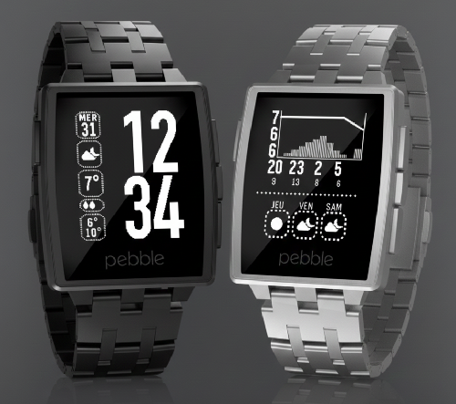

# Din Clean

Din Clean is a clean and elegant watchface for Pebble watches.  
It has been designed to give you instant access to time and weather information, with a focus on readability and simplicity.

## Key features

**Clarity first**  
Large, crisp digits make the time easy to read in any condition. You can choose between several fonts to match your preference. The display automatically adapts to 12h or 24h formats.

**Complete weather at a glance**  
A single tap on the watch reveals a clear weather graph showing the next 12 hours of temperature, precipitation, and wind speed, plus a three‑day forecast.  
Data is provided by the MET Norway API, which is free and requires no subscription or API key.

**Readable forecast**  
Color indicators help you quickly identify temperature trends: red for warm, blue for cold. You can understand the coming weather in just a glance.

**Battery‑friendly**  
Din Clean minimizes weather updates to only when they’re truly needed. This helps preserve battery life without sacrificing data freshness or reliability.

**Optional smart home integration**  
If you own an IOPool sensor, you can monitor your pool’s water temperature, pH, and ORP directly on the watch. Visual warnings appear automatically if values go out of range.

**Multilingual and customizable**  
The watchface adapts to your system language (English, French, German, Spanish) and lets you personalize colors, icons, vibration alerts, and Bluetooth behavior.

## Technical improvements

The codebase has been fully refactored for better stability and lower memory usage.  
Graphics have been reduced in size by 50‑70%, and each module (time, weather, icons) only loads what is necessary.

## Compatibility

- Pebble Classic  
- Pebble Time / Time Steel  
- Pebble 2  

Pebble app required with location access for weather data.
